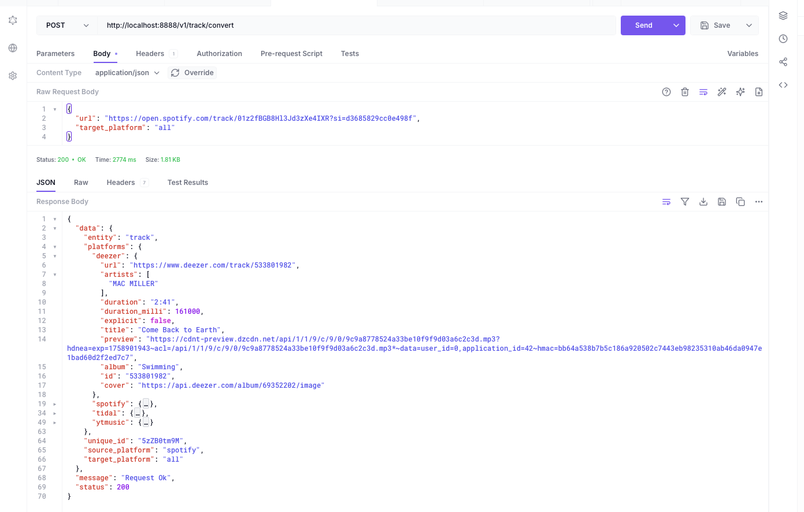

```txt
⚠️ This repo is undergoing quite significant cleaning up and reworking. Some endpoints/APIs might not be available, some datapoints might be missing and you might have development issues. Create a new issue for a new support.

Please check back to be aware when its back to stable.
```

## ORCHDIO

Orchdio is an API first platform for cross-platform streaming services apps. The goal is to provide simple and easy to use unified APIs for digital streaming platforms.

The current streaming platforms all do the same thing which is to stream music — and many people use different accounts on each of these platforms. This poses
a problem for both users and developers; developers have to write the same code to use music streaming api on each platform, and users have to maintain separate accounts on each platform, Orchdio solves this by providing unified, cross-platform APIs that enable developers build on various streaming services at once and allow users take charge of their accounts from several services in one place.


### You can find the developer documentation [here](https://orchdio-labs.gitbook.io/orchdio-api-documentation/)



#### Building and running the project locally


Dependencies:
 - Go 1.24
 - Redis
 - Postgres
 - Svix (Webhook provider)

Set the environment variable `ORCHDIO_ENV=dev`. The application looks for a `.env.dev` file in the root directory, if the environment variable value is
dev. Otherwise, the application looks for a `.env` file instead. Then run the following commands:
```bash

 $ export ORCHDIO_ENV=dev
 $ go build -o cmc/orchdio && ./cmd/orchdio
   ```


Please check the `.env.example` file to see the possible env various needed and their suggested values.

```txt

 ⚠️ You'd need to setup [Svix](https://www.svix.com). This is a Webhook as a Service provider and used as the supported webhook delivery platform in Orchdio. Please follow the documentation to get started. You can use Orchdio without setting up Svix but you'll not be able to get Webhook events on the status of your conversions and other actions.
```


The following could be helpful in development:
- [Asynqmon](https://github.com/hibiken/asynqmon): This is a web UI for the [Asynq](https://github.com/hibiken/asynq) task queue used for working with queues.
- [Tunnelto](https://tunnelto.dev/) : for exposing local servers over the internet using a custom subdomain, over HTTPs. This is useful when working with webhooks.
